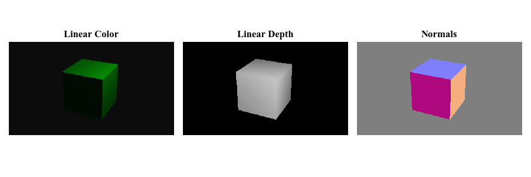
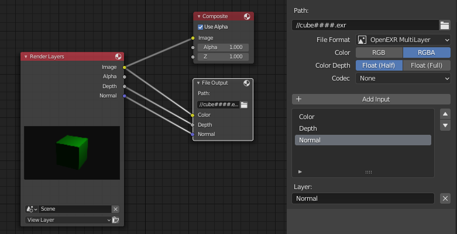

# minexr

**minexr** is a standalone, fast Python [OpenEXR](https://www.openexr.com/) reader for single-part, uncompressed scan-line files. It is compatible with `.exr` files produced by [Blender](http://blender.org).

## Assumptions

**minexr** makes a couple of assumptions about the `.exr` file to be read:

1.  single-part files with arbitrary number of channels,
1.  no pixel data compression, and
1.  equal channel types (HALF, FLOAT, UINT).

These assumptions allow us to efficiently parse and read the `.exr` file. In particular we gain constant offsets between scan lines which allows us to read the entire image in (H,C,W) format without copying.

## Usage

The following is taken from [example.py](./example.py)

```python
import minexr

with open('file.exr', 'rb') as fp:
        reader = minexr.load(fp)
        rgba = reader.select(['Color.R','Color.G','Color.B','Color.A'])
        # a HxWx4 np.array with dtype based on exr type.
        ...
```

Full [example.py](./example.py) loads the following images

<p align="center">
  
</p>

which were previously rendered using Blender/EEVEE [cube.blend](./etc/cube.blend).

## Runtime

The following timings are produced by [bench.py](./bench.py) by repeatable reading an RGBA image from an `.exr` file. Timings include file and numpy operations.

|    Module     | [sec/image] | Note                        |
| :-----------: | :---------: | --------------------------- |
| OpenEXR 1.3.2 |    0.020    | with channel concatenate    |
| OpenEXR 1.3.2 |    0.015    | without channel concatenate |
|  **minexr**   |  **0.004**  | with channel concatenate    |

## Install

Either via pip

```
pip install minexr
```

Or clone this repository and invoke

```
pip install -e .
```

## Tests

To run the tests

```
pytest
```

## Blender support

Use a `FileOutput` node in Blender's compositor to export `.exr` files. Make sure to select `OpenEXR MultiLayer` format and set `CODEC` to None as shown in the following image. `Color Depth` can be chosen as required.

<p align="center">
  
</p>
When unsure about which channels are being written, you can inspect the file content as follows

```python
import minexr

with open('file.exr', 'rb') as fp:
        reader = minexr.load(fp)
        print(reader.channel_names)
        # ['Color.R','Color.G','Color.B', ...]
        print(reader.attrs)
        # Dictionary of all OpenEXR header attributes.
```
